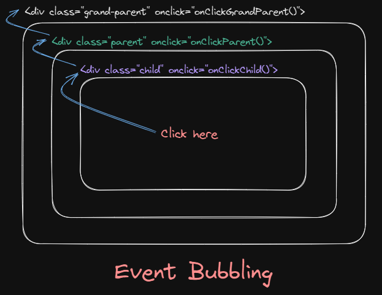
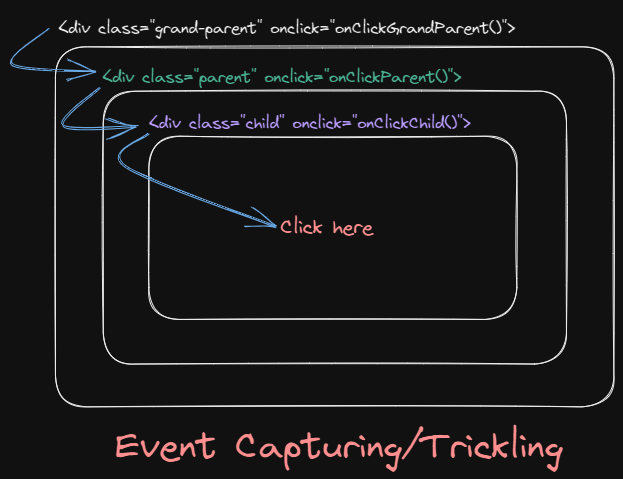

# Event, Event Bubbling, Capturing aka Trickling in Javascript

## Event

The Event interface represents an event/signal which takes place in the browser or the user interface. An event can be triggered by the user action e.g. clicking the mouse button or tapping keyboard, or generated by APIs to represent the progress of an asynchronous task.

<br>

## Event handlers

To react on events we can assign a handler – a function that runs in case of an event.

<br>

## These are 2 ways of event propagation in the DOM tree - 1. Event Bubbling & 2. Event Capturing

## 1. Event Bubbling

As bubbles always comes out or go upwards, event bubbling happens from `Child to Parent`, down to up of the hierarchy.

### Example:



So we have 3 div's and have event handlers attached with them.

Propagation of the events on clicking child div ->

In case of event bubbling, if i click
on div with children class then the onClickChild() event handler
method will be called first then it moves up to the hierarchy &
it goes till the end of the DOM. So after onClickChild() get
called, it calls onClickParent() & then it calls onClickGrandParent().

<br>

## 2. Event Capturing / Event Trickling

Opposite of Event Bubbling. Happens from `Parent to Child`, up to down of the hierarchy.

Propagation of the events on clicking child div ->

1. onClickGrandParent(),
2. onClickParent(),
3. onClickChild()

### Example:




```
addEventListener(param-1, param-2, param-3) 

@param-1: event example- 'click'
@param-2: callback fnc, the func which will be called when the event happen
@param-3: true or false, useCapture boolean flag, true => capturing, false or nothing passed => bubbling
```

`When useCapture flag set as true, event capturing mode is enabled & for false, event bubbling is enabled. Or if we don't pass anything or pass falsy value as 3rd param, then it will be bubbling.`
